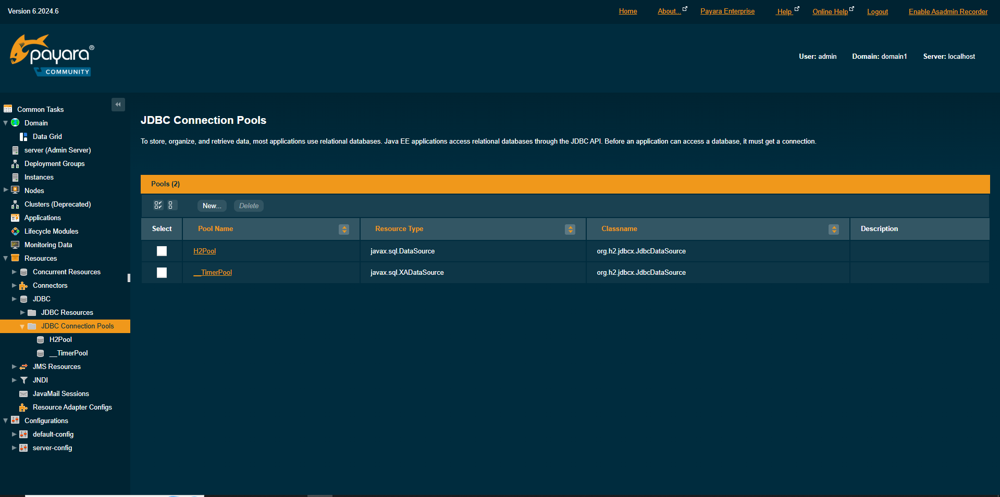
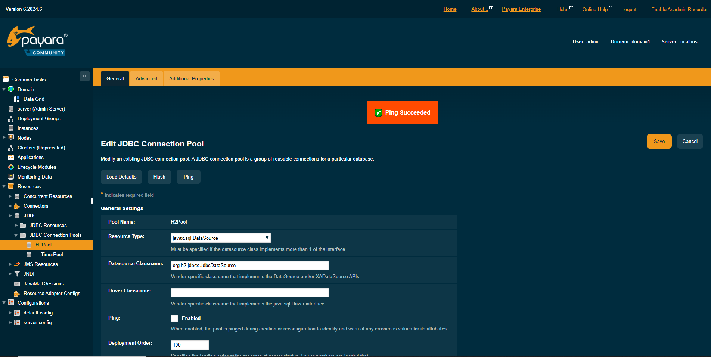

# TP Docker — MySQL + Java App Server
## Datos del alumno
- Nombres: Franco Couturier, Leandro Lopez 
## 1. ¿Qué es Docker?
- Docker es una plataforma de contenedores que permite empaquetar una aplicación junto con todas sus dependencias en una unidad estandarizada llamada contenedor. A diferencia de las máquinas virtuales, los contenedores comparten el kernel del sistema operativo anfitrión, lo que los hace extremadamente ligeros y portátiles.

## 2. Volúmenes en Docker
- Volumen (Volume)
Un volumen es un mecanismo de persistencia gestionado por Docker. Permite que los datos sobrevivan al ciclo de vida del contenedor. Existen tres tipos principales:
Named Volumes: gestionados por Docker, recomendados para bases de datos.
Bind Mounts: mapeo directo de un directorio del host.
tmpfs Mounts: almacenamiento en memoria RAM (no persistente).

## 3. Redes en Docker
| Tipo | Descripción | Uso típico |
| :--- | :--- | :--- |
| **bridge** | Red privada aislada. Contenedores se comunican por nombre. | Desarrollo, microservicios |
| **host** | El contenedor comparte la red del host directamente. | Alto rendimiento (Linux) |
| **none** | Sin acceso a red. | Procesos batch aislados |
| **overlay** | Red multi-host para Docker Swarm. | Producción distribuida |

## 4. ¿Por qué Payara Server?
Para un entorno Docker Java empresarial con GUI, **Payara Server** es la opción más recomendable por las siguientes razones:

* **Soporte Empresarial:** Es una distribución de GlassFish mantenida activamente con soporte de producción.
* **Estándares Jakarta EE:** Soporta el stack completo: JPA, EJB, JAX-RS, CDI, JMS, y más.
* **Consola de Administración (GUI):** Incluye *Payara Admin Console*, una interfaz web accesible en el puerto `4848`.
* **Optimización Docker:** Tiene imágenes oficiales actualizadas y optimizadas para contenedores.
* **Escalabilidad:** Escala perfectamente de desarrollo a producción sin cambiar el stack tecnológico.

## 5. Explicación del docker-compose.yml
...
## 6. Explicación del init.sql
...
## 7. Dificultades y soluciones

# Capturas de Pantalla Obligatorias

## **Parte 1 — Infraestructura Docker (5 capturas)**

## 1. Salida de docker --version y docker info en la terminal

PS H:\> docker --version
Docker version 29.4.0, build 9d7ad9f

## 2. Salida de docker network ls mostrando la red java-net

PS H:\> docker network ls
NETWORK ID     NAME       DRIVER    SCOPE
9260cbd20b1f   bridge     bridge    local
8f2b2db2905b   host       host      local
f2ef155ab6fa   java-net   bridge    local
2066e86aff17   none       null      local

## 3. Salida de docker volume inspect mysql-data

PS H:\> docker volume inspect mysql-data
[
    {
        "CreatedAt": "2026-05-07T22:18:23Z",
        "Driver": "local",
        "Labels": null,
        "Mountpoint": "/var/lib/docker/volumes/mysql-data/_data",
        "Name": "mysql-data",
        "Options": null,
        "Scope": "local"
    }
]

## 4. Salida de docker ps con ambos contenedores activos

PS H:\> docker ps
CONTAINER ID   IMAGE                         COMMAND                  CREATED              STATUS              PORTS                                                                                                                                   NAMES
e5454cb28af8   payara/server-full:6.2024.6   "tini -- /bin/sh -c …"   About a minute ago   Up About a minute   0.0.0.0:4848->4848/tcp, [::]:4848->4848/tcp, 0.0.0.0:8080->8080/tcp, [::]:8080->8080/tcp, 0.0.0.0:9009->9009/tcp, [::]:9009->9009/tcp   payara-container
ff77d41d21f1   mysql:8.0                     "docker-entrypoint.s…"   10 minutes ago       Up 10 minutes       0.0.0.0:3306->3306/tcp, [::]:3306->3306/tcp                                                                                             mysql-container

## 5. docker network inspect java-net con ambos contenedores en la red

PS H:\> docker network inspect java-net
[
    {
        "Name": "java-net",
        "Id": "f2ef155ab6faa9de892069a743fab02d14007a09cb29432a5f71b81cc17f130a",
        "Created": "2026-05-07T22:07:57.679851004Z",
        "Scope": "local",
        "Driver": "bridge",
        "EnableIPv4": true,
        "EnableIPv6": false,
        "IPAM": {
            "Driver": "default",
            "Options": {},
            "Config": [
                {
                    "Subnet": "172.20.0.0/16",
                    "Gateway": "172.20.0.1"
                }
            ]
        },
        "Internal": false,
        "Attachable": false,
        "Ingress": false,
        "ConfigFrom": {
            "Network": ""
        },
        "ConfigOnly": false,
        "Options": {
            "com.docker.network.enable_ipv4": "true",
            "com.docker.network.enable_ipv6": "false"
        },
        "Labels": {},
        "Containers": {
            "e5454cb28af8dbf7ec382c228c49e7d53d11083f01fe8726b3950b902928413c": {
                "Name": "payara-container",
                "EndpointID": "8565794b4d8ad10d2826b826f2a59805a5291dd45800b0e0a7ac56e1ba12029d",
                "MacAddress": "7e:74:7d:c9:65:3c",
                "IPv4Address": "172.20.0.3/16",
                "IPv6Address": ""
            },
            "ff77d41d21f1046faa6673816c6926546c3c7d561257776a91e4b336bd05ccac": {
                "Name": "mysql-container",
                "EndpointID": "6d833e984268666fddfa8cfdcd32ccc9c1963548032aa2a6197949cac4c9d340",
                "MacAddress": "b6:6d:93:ec:d0:58",
                "IPv4Address": "172.20.0.2/16",
                "IPv6Address": ""
            }
        },
        "Status": {
            "IPAM": {
                "Subnets": {
                    "172.20.0.0/16": {
                        "IPsInUse": 5,
                        "DynamicIPsAvailable": 65531
                    }
                }
            }
        }
    }
]

## **Parte 2 — MySQL (3 capturas)**
## 6. Logs de MySQL mostrando: ready for connections

PS H:\> docker exec -it payara-container ping mysql-container -c 4
PING mysql-container (172.20.0.2) 56(84) bytes of data.
64 bytes from mysql-container.java-net (172.20.0.2): icmp_seq=1 ttl=64 time=0.058 ms
64 bytes from mysql-container.java-net (172.20.0.2): icmp_seq=2 ttl=64 time=0.068 ms
64 bytes from mysql-container.java-net (172.20.0.2): icmp_seq=3 ttl=64 time=0.072 ms
64 bytes from mysql-container.java-net (172.20.0.2): icmp_seq=4 ttl=64 time=0.064 ms

--- mysql-container ping statistics ---
4 packets transmitted, 4 received, 0% packet loss, time 3070ms
rtt min/avg/max/mdev = 0.058/0.065/0.072/0.005 ms

## 7. Salida de SHOW DATABASES; mostrando la base appdb

2026-05-07T22:22:38.948887Z 0 [System] [MY-011323] [Server] X Plugin ready for connections. Bind-address: '::' port: 33060, socket: /var/run/mysqld/mysqlx.sock
2026-05-07T22:22:38.949095Z 0 [System] [MY-010931] [Server] /usr/sbin/mysqld: ready for connections. Version: '8.0.46'  socket: '/var/run/mysqld/mysqld.sock'  port: 3306  MySQL Community Server - GPL.

## 8. Salida de SELECT * FROM usuarios; con los datos del init.sql

mysql> SHOW DATABASE
    -> ^C
mysql> SHOW DATABASES;
+--------------------+
| Database           |
+--------------------+
| appdb              |
| information_schema |
| mysql              |
| performance_schema |
| sys                |
+--------------------+
5 rows in set (0.00 sec)

+----+-----------+-------------------+---------------------+
| id | nombre    | email             | creado_en           |
+----+-----------+-------------------+---------------------+
|  1 | Admin     | admin@example.com | 2026-05-07 23:40:23 |
|  2 | Test User | test@example.com  | 2026-05-07 23:40:23 |
+----+-----------+-------------------+---------------------+

## **Parte 3 — Payara Admin Console / GUI (5 capturas)**
## 9. Pantalla de login de Admin Console en http://localhost:4848

Loggeado

## 10. Dashboard principal de Payara tras iniciar sesión

Hecho

## 11. Pantalla del Connection Pool MySQLPool creado

## 12. Resultado del botón Ping mostrando conexión exitosa a MySQL

## 13. JDBC Resource jdbc/MySQLDS visible en la consola

## Parte 4 — Conectividad entre contenedores (1 captura)
## 14. Salida del ping de Payara hacia mysql-container desde la terminal

